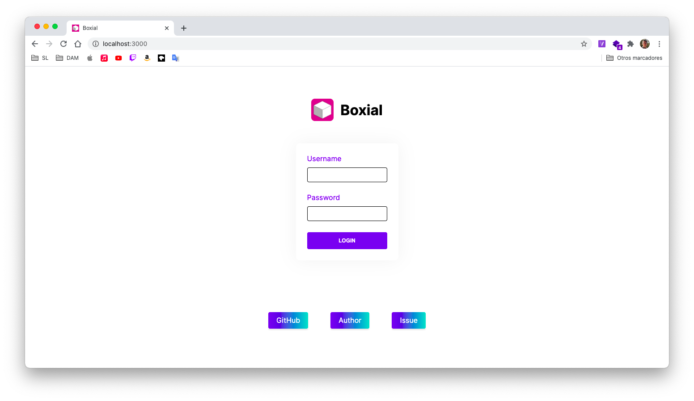
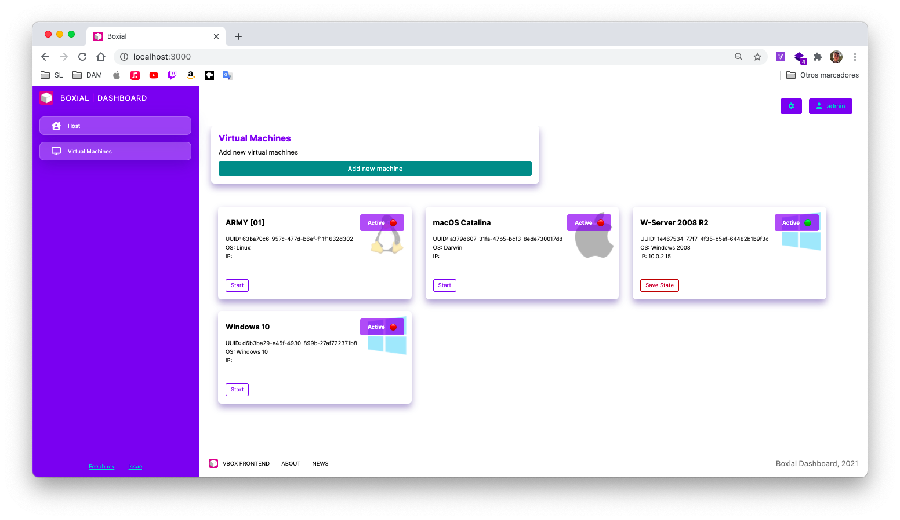
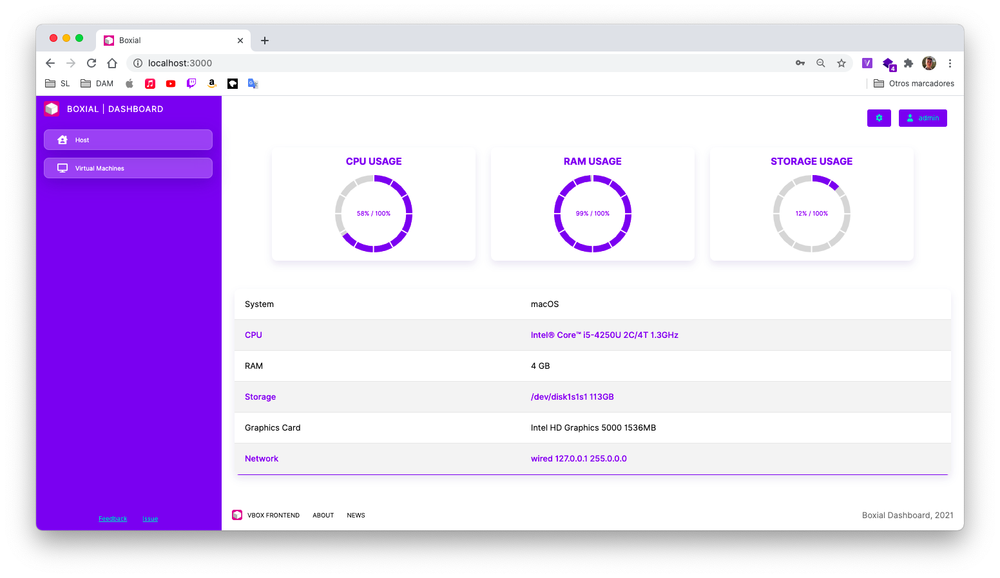

<!-- PROJECT LOGO -->
<br />
<p align="center">
  <a href="https://github.com/github_username/repo_name">
    
  </a>
    <h3 align="center"><b><font size="56">Boxial</font></b></h3>
  <p align="center">
    <br />
  </p>
    <hr />
    <br />
</p>

A virtual machine dashboard manager using React, Express and NodeJS







## Setup

### Install dependencies

Install the dependencies for the client and server.

```bash
# in one terminal window
cd server && npm i
# in another terminal window
cd client && npm i
```

### Start server

An Express server is exposes an API for accessing virtual machine data and host data. Configure MySQL credentials on `server/env/db-credentials.js`, dump the `server/auth/boxial_starter.sql` to create database structure containing the admin credentials.

```bash
# in /server
npm start
```

> Server is running on `localhost:8000`.

### Start client

A React server for the front end.

```bash
# in /client
npm start
```

> Client dev server is running on `localhost:3000`.

You can view the app at `localhost:3000`. Log in with `admin` user and  password `admin`

### Production build

Run `npm run build` on `client` and `server`.